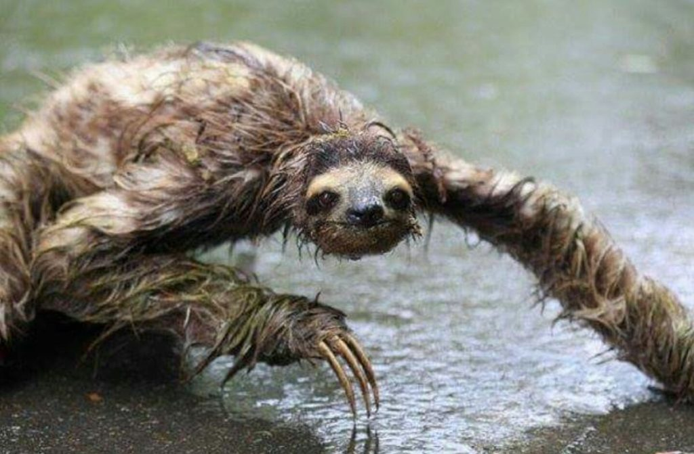

# Students against sloth propaganda
absolute hellscape of an animal
## join us in the fight against the misinformation
they are not like they are presented in media

they look like an uncanny human-animal hybrid

nightmare fuel proving my point:

[proof1](https://www.tiktok.com/@emln3m/video/6861304896109432070?is_from_webapp=v1&item_id=6861304896109432070)

### if you are scared of sloths know that you are not alone
others expressing the same sentiment:

[reddit_thread](https://www.reddit.com/r/unpopularopinion/comments/q9hey8/sloths_are_scary/)

### the big sloth lobby does not want you to know the truth

| sloths |       in media        |                   in reality                   |
|:------:|:---------------------:|:----------------------------------------------:|
| looks  |  friendly and cuddly  | a monstrosity proving that God has forsaken us |

most underrated fears to have:
- sloths
- clowns
- the IRS
- sloths again

why does it look like that?

